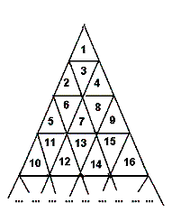

# Delta wave
2007 - my course work for Theory of Program Product Development in MGKIT:

exploring c++ and opengl in 3D visualization of pathfinding for infinite triangle of numbers.

### Problem

https://acm.timus.ru/problem.aspx?space=1&num=1302&locale=en

A triangle field is numbered with successive integers in the way shown on the picture below.

The traveller needs to go from the cell with number m to the cell with number n. The traveller is able to enter the cell through cell edges only, he can not travel from cell to cell through vertices. The number of edges the traveller passes makes the length of the traveller's route.
Write the program to determine the length of the shortest route connecting cells with numbers m and n.

### Visualization

